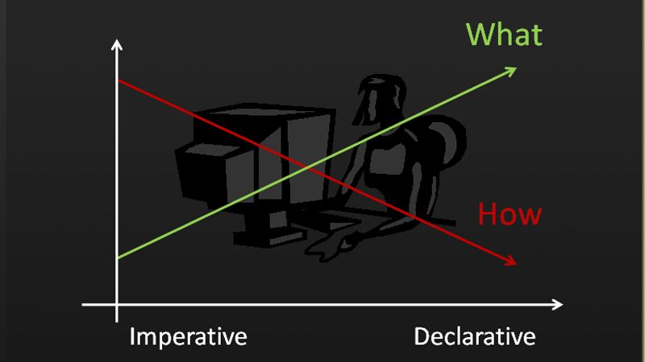

<div align="center">

# gust 🌬️

**Bring Rust's Elegance to Go**

*A production-ready library that makes error handling, optional values, and iteration as beautiful and safe as in Rust.*

[](https://github.com/andeya/gust/releases)
[](https://golang.org)
[](https://pkg.go.dev/github.com/andeya/gust)
[](https://github.com/andeya/gust/actions)
[](https://goreportcard.com/report/github.com/andeya/gust)
[](https://codecov.io/gh/andeya/gust)
[](./LICENSE)

**[English](./README.md)** | **[中文](./README_ZH.md)**

</div>

---

## 🎯 What is gust?

**gust** is a comprehensive Go library that brings Rust's most powerful patterns to Go, enabling you to write safer, cleaner, and more expressive code. With **zero dependencies** and **production-ready** quality, gust transforms how you handle errors, optional values, and data iteration in Go.

### ✨ Key Features

- 🛡️ **Type-Safe Error Handling** - Replace `(T, error)` with chainable `Result[T]`
- 🎯 **No More Nil Panics** - Use `Option[T]` instead of `*T` or `(T, bool)`
- 🚀 **Rust-like Iterators** - Full Iterator trait implementation with 60+ methods
- ⚡ **Zero Dependencies** - Pure Go, no external dependencies
- 📚 **Well Documented** - Comprehensive docs with real-world examples
- 🔒 **Production Ready** - High test coverage and battle-tested

---

## 🚀 Quick Start

```bash
go get github.com/andeya/gust
```

### Your First gust Program

```go
package main

import (
    "fmt"
    "github.com/andeya/gust/result"
)

func main() {
    // Chain operations elegantly
    res := result.Ok(10).
        Map(func(x int) int { return x * 2 }).
        AndThen(func(x int) result.Result[int] {
            if x > 20 {
                return result.TryErr[int]("too large")
            }
            return result.Ok(x + 5)
        })

    if res.IsOk() {
        fmt.Println("Success:", res.Unwrap())
    } else {
        fmt.Println("Error:", res.UnwrapErr())
    }
}
```

---

## 💡 Why gust?

### The Problem with Traditional Go

Traditional Go code is verbose and error-prone:

```go
func fetchUserData(userID int) (string, error) {
    // Step 1: Fetch from database
    user, err := db.GetUser(userID)
    if err != nil {
        return "", fmt.Errorf("db error: %w", err)
    }
    
    // Step 2: Validate user
    if user == nil {
        return "", fmt.Errorf("user not found")
    }
    if user.Email == "" {
        return "", fmt.Errorf("invalid user: no email")
    }
    
    // Step 3: Fetch profile
    profile, err := api.GetProfile(user.Email)
    if err != nil {
        return "", fmt.Errorf("api error: %w", err)
    }
    
    // Step 4: Format result
    return fmt.Sprintf("%s: %s", user.Name, profile.Bio), nil
}
```

**Issues:**
- ❌ Repetitive error handling boilerplate
- ❌ Nested if-else statements
- ❌ Hard to compose and test
- ❌ Easy to forget error checks

### The gust Solution

With gust, write declarative, composable code:

```go
import "github.com/andeya/gust/result"

func fetchUserData(userID int) result.Result[string] {
    return result.AndThen(result.Ret(getUser(userID)), func(user *User) result.Result[string] {
        if user == nil || user.Email == "" {
            return result.TryErr[string]("invalid user")
        }
        return result.Map(result.Ret(getProfile(user.Email)), func(profile *Profile) string {
            return fmt.Sprintf("%s: %s", user.Name, profile.Bio)
        })
    })
}
```

**Benefits:**
- ✅ **No error boilerplate** - Errors flow naturally through the chain
- ✅ **Linear flow** - Easy to read and understand
- ✅ **Automatic propagation** - Errors stop the chain automatically
- ✅ **Composable** - Each step is independent and testable
- ✅ **Type-safe** - Compiler enforces correct error handling

### From Imperative to Declarative

gust helps you shift from **imperative** (focusing on *how*) to **declarative** (focusing on *what*) programming:



With gust, you describe **what** you want to achieve, not **how** to achieve it step-by-step. This makes your code more readable, maintainable, and less error-prone.

---

## 📚 Core Features

### 1. Result<T> - Elegant Error Handling

Replace `(T, error)` with chainable `Result[T]` for type-safe error handling:

```go
import "github.com/andeya/gust/result"

// Chain operations that can fail
res := result.Ok(10).
    Map(func(x int) int { return x * 2 }).
    AndThen(func(x int) result.Result[int] {
        if x > 15 {
            return result.TryErr[int]("too large")
        }
        return result.Ok(x + 5)
    }).
    OrElse(func(err error) result.Result[int] {
        fmt.Println("Error handled:", err)
        return result.Ok(0) // Fallback
    })

fmt.Println("Final value:", res.Unwrap())
// Output: Error handled: too large
// Final value: 0
```

**Key Methods:**
- `Map` - Transform the value if Ok
- `AndThen` - Chain operations that return Result
- `OrElse` - Handle errors with fallback
- `Unwrap` / `UnwrapOr` - Extract values safely
- `IsOk` / `IsErr` - Check result state

**Benefits:**
- ✅ No more `if err != nil` boilerplate
- ✅ Automatic error propagation
- ✅ Chain multiple operations elegantly
- ✅ Type-safe error handling

### 2. Option<T> - No More Nil Panics

Replace `*T` and `(T, bool)` with safe `Option[T]`:

```go
import "github.com/andeya/gust/option"

// Safe division without nil checks
divide := func(a, b float64) option.Option[float64] {
    if b == 0 {
        return option.None[float64]()
    }
    return option.Some(a / b)
}

res := divide(10, 2).
    Map(func(x float64) float64 { return x * 2 }).
    UnwrapOr(0)

fmt.Println(res) // 10
```

**Key Methods:**
- `Map` - Transform the value if Some
- `AndThen` - Chain operations that return Option
- `Filter` - Conditionally filter values
- `Unwrap` / `UnwrapOr` - Extract values safely
- `IsSome` / `IsNone` - Check option state

**Benefits:**
- ✅ Eliminates nil pointer panics
- ✅ Explicit optional values
- ✅ Chain operations safely
- ✅ Compiler-enforced safety

### 3. Iterator - Rust-like Iteration in Go

Full Rust Iterator trait implementation with method chaining and lazy evaluation:

```go
import "github.com/andeya/gust/iterator"

numbers := []int{1, 2, 3, 4, 5, 6, 7, 8, 9, 10}

sum := iterator.FromSlice(numbers).
    Filter(func(x int) bool { return x%2 == 0 }).
    Map(func(x int) int { return x * x }).
    Take(3).
    Fold(0, func(acc int, x int) int {
        return acc + x
    })

fmt.Println(sum) // 56 (4 + 16 + 36)
```

**Available Methods:**

| Category | Methods |
|----------|---------|
| **Constructors** | `FromSlice`, `FromElements`, `FromRange`, `FromFunc`, `FromIterable`, `Empty`, `Once`, `Repeat` |
| **BitSet Iterators** | `FromBitSet`, `FromBitSetOnes`, `FromBitSetZeros`, `FromBitSetBytes`, etc. |
| **Go Integration** | `FromSeq`, `FromSeq2`, `FromPull`, `FromPull2`, `Seq`, `Seq2`, `Pull`, `Pull2` |
| **Basic Adapters** | `Map`, `FilterMap`, `RetMap`, `OptMap`, `Chain`, `Zip`, `Enumerate` |
| **Filtering Adapters** | `Filter`, `Skip`, `Take`, `StepBy`, `SkipWhile`, `TakeWhile` |
| **Transforming Adapters** | `MapWhile`, `Scan`, `FlatMap`, `Flatten` |
| **Chunking Adapters** | `MapWindows`, `ArrayChunks`, `ChunkBy` |
| **Utility Adapters** | `Fuse`, `Inspect`, `Intersperse`, `IntersperseWith`, `Cycle`, `Peekable` |
| **Consumers** | `Fold`, `Reduce`, `Collect`, `Count`, `Last`, `All`, `Any`, `Find`, `Sum`, `Product`, `Partition`, `AdvanceBy`, `Nth`, `NextChunk` |
| **Search & Find** | `Find`, `FindMap`, `Position`, `All`, `Any` |
| **Min/Max** | `Max`, `Min`, `MaxBy`, `MinBy`, `MaxByKey`, `MinByKey` |
| **Try Methods** | `TryFold`, `TryForEach`, `TryReduce`, `TryFind` |
| **Double-Ended** | `NextBack`, `Rfold`, `TryRfold`, `Rfind`, `AdvanceBackBy`, `NthBack` |

**60+ methods** from Rust's Iterator trait!

**Code Organization:**

The iterator package is organized into functional modules for better maintainability:

- **Core** (`core.go`): Core interfaces (`Iterable`, `Iterator`, `DoubleEndedIterator`) and base types, including double-ended methods (`NextBack`, `AdvanceBackBy`, `NthBack`, `Remaining`)
- **Constructors** (`constructors.go`): Functions to create iterators from various sources
- **Basic Adapters** (`basic.go`): Map, FilterMap, Chain, Zip, Enumerate, FlatMap
- **Filtering Adapters** (`filtering.go`): Skip, Take, StepBy, SkipWhile, TakeWhile
- **Transforming Adapters** (`transforming.go`): MapWhile, Scan, Flatten
- **Chunking Adapters** (`chunking.go`): MapWindows, ArrayChunks, ChunkBy
- **Utility Adapters** (`utility.go`): Fuse, Inspect, Intersperse, IntersperseWith, Cycle, Peekable, Cloned
- **Consumers** (`consumers.go`): Collect, Count, Last, Partition, AdvanceBy, Nth, NextChunk, Sum, Product, Unzip, TryReduce, TryForEach
- **Fold & Reduce** (`fold_reduce.go`): Fold, Reduce, ForEach, TryFold, Rfold, TryRfold
- **Find & Search** (`find_search.go`): Find, FindMap, Position, All, Any, TryFind, Rfind
- **Min & Max** (`min_max.go`): Max, Min, MaxBy, MinBy, MaxByKey, MinByKey
- **Comparison** (`comparison.go`): Comparison utilities

Each module is self-contained with its own implementation functions (`_Impl`) and iterable structs (`_Iterable`), ensuring independence and maintainability. Double-ended iterator methods are integrated into their respective functional modules (e.g., `Rfold` in `fold_reduce.go`, `Rfind` in `find_search.go`).

**Note:** For type-changing operations (e.g., `Map` from `string` to `int`), use the function-style API:

```go
iterator.Map(iterator.FromSlice(strings), func(s string) int { return len(s) })
```

For same-type operations, you can use method chaining:

```go
iterator.FromSlice(numbers).
    Filter(func(x int) bool { return x > 0 }).
    Map(func(x int) int { return x * 2 })
```

**Benefits:**
- ✅ Rust-like method chaining
- ✅ Lazy evaluation
- ✅ Type-safe transformations
- ✅ Zero-copy where possible

#### Iterator Constructors

Create iterators from various sources:

```go
import (
    "github.com/andeya/gust/iterator"
    "github.com/andeya/gust/option"
)

// From slice
iter1 := iterator.FromSlice([]int{1, 2, 3})

// From individual elements
iter2 := iterator.FromElements(1, 2, 3)

// From range [start, end)
iter3 := iterator.FromRange(0, 5) // 0, 1, 2, 3, 4

// From function
count := 0
iter4 := iterator.FromFunc(func() option.Option[int] {
    if count < 3 {
        count++
        return option.Some(count)
    }
    return option.None[int]()
})

// Empty iterator
iter5 := iterator.Empty[int]()

// Single value
iter6 := iterator.Once(42)

// Infinite repeat
iter7 := iterator.Repeat("hello") // "hello", "hello", "hello", ...
```

#### Go Standard Iterator Integration

gust iterators seamlessly integrate with Go 1.24+ standard iterators:

**Convert gust Iterator to Go's `iter.Seq[T]`:**

```go
import "github.com/andeya/gust/iterator"

numbers := []int{1, 2, 3, 4, 5}
gustIter := iterator.FromSlice(numbers).Filter(func(x int) bool { return x%2 == 0 })

// Use in Go's standard for-range loop
for v := range gustIter.Seq() {
    fmt.Println(v) // prints 2, 4
}
```

**Convert Go's `iter.Seq[T]` to gust Iterator:**

```go
import "github.com/andeya/gust/iterator"

// Create a Go standard iterator sequence
goSeq := func(yield func(int) bool) {
    for i := 0; i < 5; i++ {
        if !yield(i) {
            return
        }
    }
}

// Convert to gust Iterator and use gust methods
gustIter, deferStop := iterator.FromSeq(goSeq)
defer deferStop()
result := gustIter.Map(func(x int) int { return x * 2 }).Collect()
fmt.Println(result) // [0 2 4 6 8]
```

### 4. Double-Ended Iterator

Iterate from both ends efficiently:

```go
import "github.com/andeya/gust/iterator"

numbers := []int{1, 2, 3, 4, 5}
deIter := iterator.FromSlice(numbers).MustToDoubleEnded()

// Iterate from front
if val := deIter.Next(); val.IsSome() {
    fmt.Println("Front:", val.Unwrap()) // Front: 1
}

// Iterate from back
if val := deIter.NextBack(); val.IsSome() {
    fmt.Println("Back:", val.Unwrap()) // Back: 5
}
```

---

## 📖 Real-World Examples

### Parse and Filter with Error Handling

```go
import (
    "github.com/andeya/gust/iterator"
    "github.com/andeya/gust/result"
    "strconv"
)

// Parse strings to integers, automatically filtering out errors
numbers := []string{"1", "2", "three", "4", "five"}

results := iterator.FilterMap(
    iterator.RetMap(iterator.FromSlice(numbers), strconv.Atoi),
    result.Result[int].Ok,
).Collect()

fmt.Println("Parsed numbers:", results)
// Output: Parsed numbers: [1 2 4]
```

### Data Processing Pipeline

```go
import (
    "github.com/andeya/gust/iterator"
    "github.com/andeya/gust/result"
    "strconv"
)

// Process user input: parse, validate, transform, limit
input := []string{"10", "20", "invalid", "30", "0", "40"}

results := iterator.FilterMap(
    iterator.RetMap(iterator.FromSlice(input), strconv.Atoi),
    result.Result[int].Ok,
).
    Filter(func(x int) bool { return x > 0 }).
    Map(func(x int) int { return x * 2 }).
    Take(3).
    Collect()

fmt.Println(results) // [20 40 60]
```

### Option Chain Operations

```go
import (
    "fmt"
    "github.com/andeya/gust/option"
)

// Chain operations on optional values with filtering
res := option.Some(5).
    Map(func(x int) int { return x * 2 }).
    Filter(func(x int) bool { return x > 8 }).
    XMap(func(x int) any {
        return fmt.Sprintf("Value: %d", x)
    }).
    UnwrapOr("No value")

fmt.Println(res) // "Value: 10"
```

### Partition Data

```go
import (
    "fmt"
    "github.com/andeya/gust/iterator"
)

// Split numbers into evens and odds
numbers := []int{1, 2, 3, 4, 5, 6, 7, 8, 9, 10}

evens, odds := iterator.FromSlice(numbers).
    Partition(func(x int) bool { return x%2 == 0 })

fmt.Println("Evens:", evens) // [2 4 6 8 10]
fmt.Println("Odds:", odds)   // [1 3 5 7 9]
```

### BitSet Iteration

Iterate over bits in bit sets or byte slices with full iterator support:

```go
import (
    "fmt"
    "github.com/andeya/gust/iterator"
)

// Iterate over bits in a byte slice
bytes := []byte{0b10101010, 0b11001100}

// Get all set bit offsets
setBits := iterator.FromBitSetBytesOnes(bytes).
    Filter(func(offset int) bool { return offset > 5 }).
    Collect()
fmt.Println(setBits) // [6 8 9 12 13]

// Count set bits
count := iterator.FromBitSetBytesOnes(bytes).Count()
fmt.Println(count) // 8

// Sum of offsets of set bits
sum := iterator.FromBitSetBytesOnes(bytes).
    Fold(0, func(acc, offset int) int { return acc + offset })
fmt.Println(sum) // 54 (0+2+4+6+8+9+12+13)
```

---

## 📦 Additional Packages

gust provides several utility packages to extend its functionality:

| Package | Description |
|---------|-------------|
| **`gust/dict`** | Generic map utilities (Filter, Map, Keys, Values, Get, etc.) |
| **`gust/vec`** | Generic slice utilities (MapAlone, Get, Copy, Dict, etc.) |
| **`gust/conv`** | Type-safe value conversion and reflection utilities |
| **`gust/digit`** | Number conversion utilities (base conversion, FormatByDict, ParseByDict) |
| **`gust/random`** | Secure random string generation with optional timestamp encoding |
| **`gust/bitset`** | Thread-safe bit set implementation with bitwise operations and iterator integration |
| **`gust/option`** | Helper functions for `Option[T]` (Map, AndThen, Zip, Unzip, Assert) |
| **`gust/result`** | Helper functions for `Result[T]` (Map, AndThen, Assert, Flatten) |
| **`gust/iterator`** | Rust-like iterator implementation (see [Iterator section](#3-iterator---rust-like-iteration-in-go)) |
| **`gust/syncutil`** | Concurrent utilities (SyncMap, Mutex wrappers, Lazy initialization) |
| **`gust/errutil`** | Error utilities (Stack traces, Panic recovery, ErrBox) |
| **`gust/constraints`** | Type constraints (Ordering, Numeric, etc.) |

### Quick Examples

**Dict utilities:**
```go
import "github.com/andeya/gust/dict"

m := map[string]int{"a": 1, "b": 2, "c": 3}
value := dict.Get(m, "b").UnwrapOr(0) // 2
filtered := dict.Filter(m, func(k string, v int) bool { return v > 1 })
```

**Vec utilities:**
```go
import "github.com/andeya/gust/vec"

numbers := []int{1, 2, 3, 4, 5}
doubled := vec.MapAlone(numbers, func(x int) int { return x * 2 })
```

**Random utilities:**
```go
import "github.com/andeya/gust/random"

// Generate random strings
gen := random.NewGenerator(false) // case-insensitive (base62)
str := gen.RandomString(16).Unwrap() // e.g., "a3B9kL2mN8pQ4rS"

// Generate with embedded timestamp
strWithTime := gen.StringWithNow(20).Unwrap()
timestamp := gen.ParseTimestamp(strWithTime).Unwrap() // Extract timestamp
```

**BitSet utilities:**
```go
import "github.com/andeya/gust/bitset"
import "github.com/andeya/gust/iterator"

// Basic operations (see ExampleBitSet_basic)
bs := bitset.New()
bs.Set(0, true).Unwrap()
bs.Set(5, true).Unwrap()

// Use with iterators (see ExampleBitSet_iterator)
setBits := iterator.FromBitSetOnes(bs).Collect() // [0 5]

// Bitwise operations (see ExampleBitSet_bitwiseOperations)
bs1 := bitset.NewFromString("c0", bitset.EncodingHex).Unwrap()
bs2 := bitset.NewFromString("30", bitset.EncodingHex).Unwrap()
or := bs1.Or(bs2)

// Encoding/decoding (see ExampleBitSet_encoding)
encoded := bs.String() // Base64URL encoding (default)
decoded := bitset.NewFromBase64URL(encoded).Unwrap() // Round-trip
```

**SyncUtil utilities:**
```go
import "github.com/andeya/gust/syncutil"

// Thread-safe map
var m syncutil.SyncMap[string, int]
m.Store("key", 42)
value := m.Load("key") // Returns Option[int]

// Lazy initialization
lazy := syncutil.NewLazy(func() int {
    return expensiveComputation()
})
value := lazy.Get() // Computed only once
```

For more details, see the [full documentation](https://pkg.go.dev/github.com/andeya/gust) and [examples](./examples/).

---

## 🔗 Resources

- 📖 **[Full Documentation](https://pkg.go.dev/github.com/andeya/gust)** - Complete API reference with examples
- 💡 **[Examples](./examples/)** - Comprehensive examples organized by feature
- 🌐 **[中文文档](./README_ZH.md)** - Chinese documentation
- 🐛 **[Issue Tracker](https://github.com/andeya/gust/issues)** - Report bugs or request features
- 💬 **[Discussions](https://github.com/andeya/gust/discussions)** - Ask questions and share ideas

---

## 📋 Requirements

- **Go 1.24+** (required for generics and standard iterator support)

---

## 🤝 Contributing

We welcome contributions! Whether you're:

- 🐛 **Reporting bugs** - Help us improve by reporting issues
- 💡 **Suggesting features** - Share your ideas for new features
- 📝 **Improving docs** - Help make our documentation better
- 🔧 **Submitting PRs** - Contribute code improvements

Every contribution makes gust better! Please see our [Contributing Guidelines](CONTRIBUTING.md) (if available) or feel free to submit a Pull Request or open an issue.

### Development Setup

```bash
# Clone the repository
git clone https://github.com/andeya/gust.git
cd gust

# Run tests
go test ./...

# Run tests with coverage
go test -coverprofile=coverage.out ./...
go tool cover -html=coverage.out
```

---

## 📄 License

This project is licensed under the **MIT License** - see the [LICENSE](./LICENSE) file for details.

---

<div align="center">

**Made with ❤️ for the Go community**

*Inspired by Rust's `Result`, `Option`, and `Iterator` traits*

[⭐ Star us on GitHub](https://github.com/andeya/gust) • [📖 Documentation](https://pkg.go.dev/github.com/andeya/gust) • [🐛 Report Bug](https://github.com/andeya/gust/issues) • [💡 Request Feature](https://github.com/andeya/gust/issues/new)

</div>
